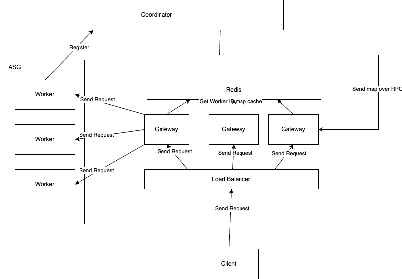

# ZoneScaler

Distributed Game Server



# Setup

Prerequisites:

-   Go Version 1.20
-   Docker

1. Clone repo:

```sh
git clone git@github.com:hrand1005/ZoneScaler.git
```

2. From repository root, run docker compose:

```sh
docker-compose up
```

3. To stop running containers:

```sh
docker-compose down
```

You might also want to build images and run containers individually:

Coordinator:

```sh
docker build -t coordinator-image -f cmd/coordinator/Dockerfile .
docker run -p 8080 coordinator-image
```

Worker:

```sh
docker build -t worker-image -f cmd/worker/Dockerfile .
docker run -p 8081 worker-image
```

Other scripts used during development are available in `scripts/`.

# Configuration

Example config files for each service are found in `cmd/<service_name>/config.json`.
These typically include server configurations such as host and port numbers.
Some services provide a simple frontend for visualization, diagnostics, logs etc.
In these caess, the root directory for 'statically served' files is set by
the `static_dir` field. For an example, check out [cmd/coordinator/config.json](cmd/coordinator/config.json).
